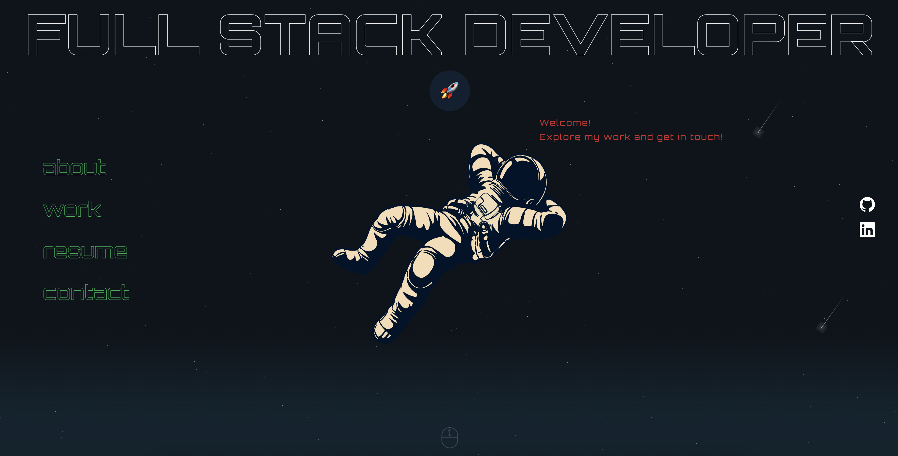

# 🚀 Full Stack Developer Portfolio

Welcome to my personal portfolio website! This project showcases my skills, projects, and experience as a full stack software engineer.

## 🌐 Live Demo
🔗 [Portfolio Website](https://alexeirusu.com)

## 📸 Preview


## 🛠️ Tech Stack
 **Frontend:** React.js, Vite, SCSS, framer-motion, ThreeJS


## 📂 Project Structure
```
/portfolio
 ├── /public          # Static assets
 ├── /src
 │   ├── /components  # Reusable UI components
 │   ├── /3Dmodel     # 3D Model
 │   ├── /pages       # Next.js pages
 │   ├── /assets      # Global assets
 │   ├── /json        # Json for projects
 ├── package.json     # Dependencies
 ├── readme.md        # Project documentation
```

## 📜 Features
✅ Responsive design
✅ Interactive animations
✅ Dynamic project showcase
✅ Contact form with email integration


